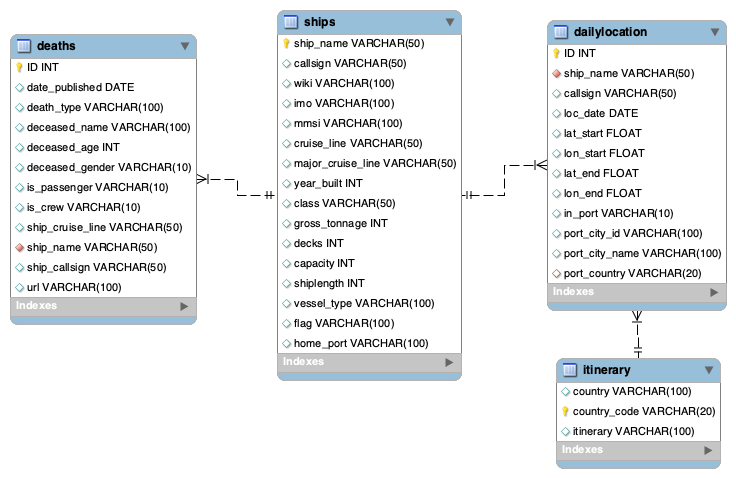

# Term project

## Gathering the data

Coming from the hospitality industry, I wanted to find data related to that since I would understand it.  
I found a great data set on cruise lines, which really interest me.

I found my data on data.works.
The data has been collected and previously analysed by Brandon Telle.
This is the link: https://data.world/brandon-telle/cruise-ship-locations

Additionally to the data from Brandol Telle I also gathered my own data about the cruise itinieraries by hand from the MSC website.
This is the specific URL: https://www.msccruises.com/en-gl/Plan-Book/Find-Cruise.aspx

## Cleaning the data

The data required some cleaning  since it was very large and had some errors when reading into SQL.
I will shortly describe the cleaning process by table.

1. ships  
This table did not require any cleaning. It already had all the data in the correct format.

2. death  
There was a lot of data not added to the table here. I needed to click through the URL-s for many webpages to gather the name of the cruise ship and the cruise line by hand. This was neccessary since I later use the ship name to join this table to another table.

3. dailylocation  
I deleted some columns from this table which where unneccessary for my analysis. This was crucial since this table has so many observations that limiting the columns made it easier to work with and able to load into MySQL in a reasobale time.

4. cities  
This table I ended up discarding since it was not complete and the information was already contained in the dailylocation table.

5. itineraries  
Since i put this table together to my liking it did not require cleaning.

All the cleaned data has been moved to the cleaned folder and should be used when reading files into MySQL.

## Operational layer

After laoding the tables into SQL, this is the schema they create:

## Analytical plan

My most interesting table is deaths. It shows the number of people dying on cruise ships from 2005 to 2017.
With the other tables I would like to answer the question:
*Which route did most people die on?*

Class | Measure
:-----| :-------------
Fact  | Death
Dimension  | Date
Dimension  | Passanger or Crew
Dimension  | Ship name
Dimension  | Cruise line
Dimension  | Itinerary

To do this I need to create the following:

1. An analytical layer  
One table that includes all the information I need (death date, if they are a passenger, ship name, major cruise line, and the itinerary they are on)

2. ETL  
I first create a stored procedure that loads the data into my table the first time.  
Then I create triggers that will update that table whenever a new death is added.

3. Data Marks  
I will create views that answer a specific question asked in the analytics.

## Analytical layer

I decided to first create the table since it allowed me to add an auto-incremented ID column. Since I was combining three tables this was safer than pulling one of the IDs from the previous tables.

## ETL

I ran into some trouble trying to create the jon on the country code in two tabled. I found on that there was an additional space at the end of one of these columns that made them not equal and therefore could not be combined. I included this transformation in my stored procedure so the JOIN could be executed without any issues.

The first JOIN I tried was too large, therefore, I needed to cut down. I decided to first do a smaller JOIN of two tabled and then use that to join the other tables. This was easier for the computer to handle. I executed the first JOIN as a LEFT JOIN so that I would not loose observations early.
Because of these two tables I also needed to create two triggers so that the data could be pulled from the original to the first join table and from there to the final analytical table.

I also created a messages table to keep track of all the triggers executed.

## Data Marks

After successfully creating my analytical data layer, I created three views to show interesting comparisons in the data.

For the first one, I answered the original question by comparing the Carribean to the Northern Europe itinerary in terms of death numbers.

For the second, I wanted to see how the deatsh spread out over the years. Therefore I grouped the deaths by year.

For the last, I wanted to see how different companies within the cruise industry compare to each other.

Of course the specific itineraries or companies can be easily exchanged or replicated for other companies. 

